<p align="center">
  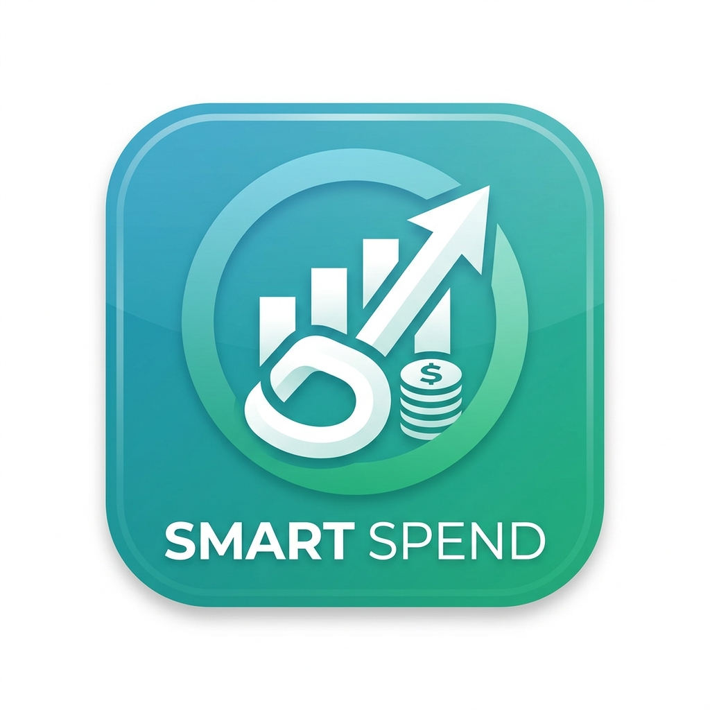
</p>

<h1 align="center">Smart Spend</h1>

<p align="center">
  <strong>AI-Powered Expense Tracker</strong>
  <br>
  Scan receipts, track spending, and get intelligent insights — all in one app.
</p>

<p align="center">
  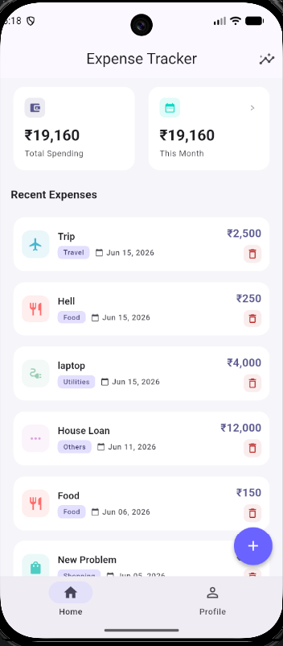
  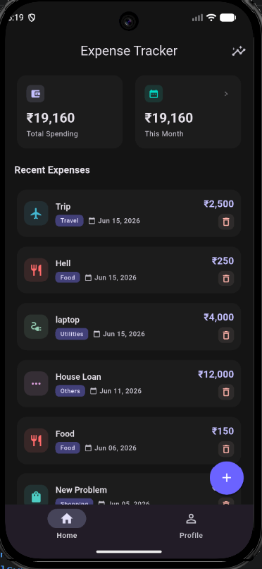
  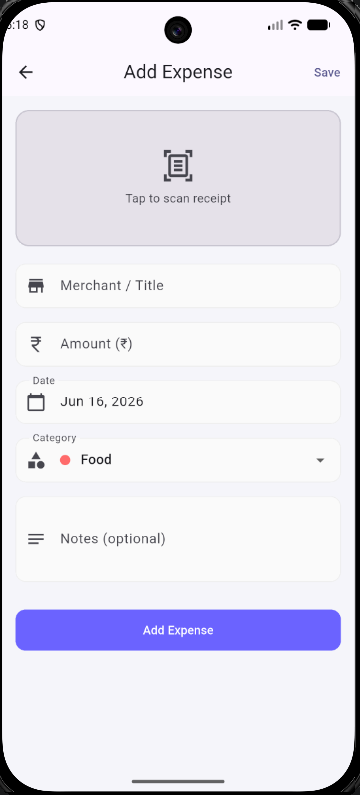
  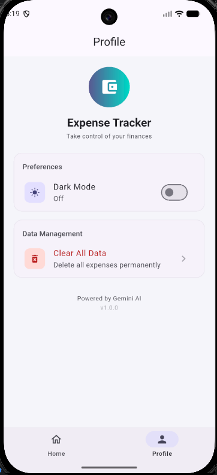
</p>

## ✨ Features

- **📷 AI Receipt Scanning** — Snap a photo of any bill or receipt. Gemini AI automatically extracts merchant name, amount, date, and category.
- **📊 Monthly Insights** — Pie chart breakdown of spending by category with animated visuals and detailed breakdowns.
- **🤖 AI Spending Analysis** — Get personalized financial insights and recommendations powered by Gemini AI.
- **🌙 Dark Mode** — Seamless light/dark theme toggle with a modern Material 3 design.
- **📱 Onboarding Flow** — Beautiful 3-step intro screens shown on first launch.
- **💾 Local Storage** — All data stored securely on-device using Hive. No cloud uploads.

<p align="center">
  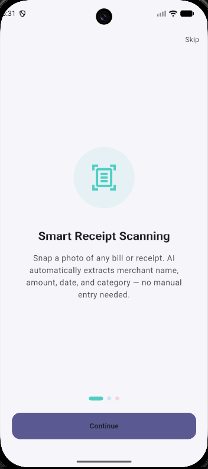
  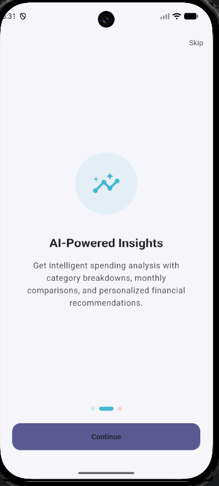
  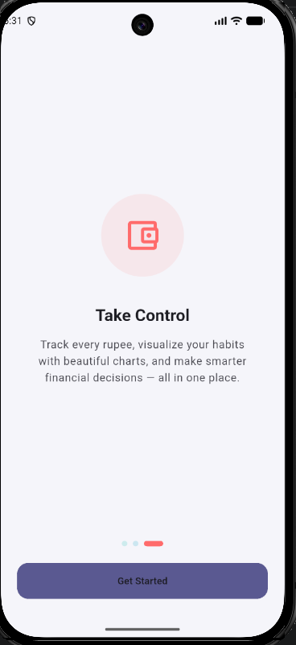
</p>

## 📈 Screens

| Screen | Description |
|--------|-------------|
| **Home** | Overview with total spending, this month's total, and recent expenses list |
| **Add Expense** | Manual entry or scan a receipt with camera/gallery. Auto-fills from AI scan |
| **Month Details** | Animated pie chart and category-wise breakdown of monthly spending |
| **AI Insights** | AI-generated spending analysis and recommendations |
| **Profile** | Theme toggle, clear all data, and app info |

<p align="center">
  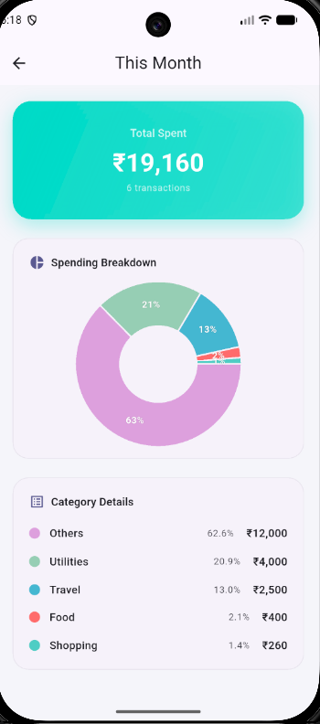
  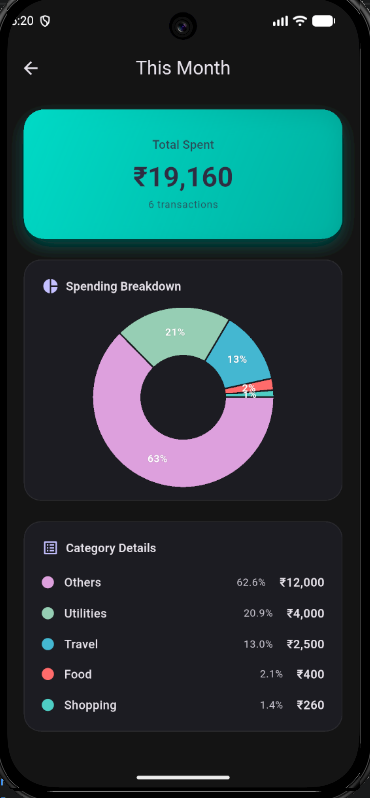
  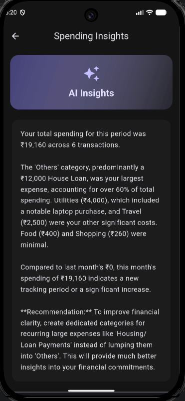
  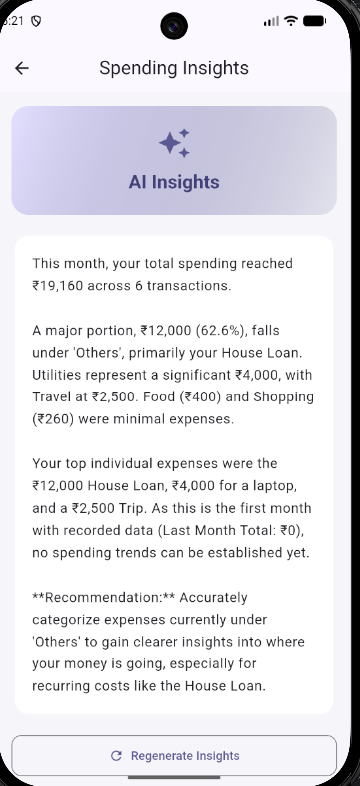
</p>

## 🛠️ Tech Stack

| Technology | Purpose |
|------------|---------|
| **Flutter** | Cross-platform UI framework |
| **BLoC / Cubit** | State management |
| **Hive** | Local storage (NoSQL) |
| **Gemini AI** | Receipt scanning & insights |
| **Google ML Kit** | On-device text recognition |
| **fl_chart** | Pie chart visualizations |
| **Material 3** | Modern design language |

## 🚀 Getting Started

### Prerequisites

- Flutter SDK (3.11.5+)
- Dart SDK (3.11.5+)
- Android Studio / VS Code
- A Gemini API key

### Installation

```bash
# Clone the repository
git clone https://github.com/yourusername/smart_spend.git
cd smart_spend

# Install dependencies
flutter pub get

# Set up your API key
echo "GEMINI_API_KEY=your_api_key_here" > .env

# Run the app
flutter run
```

### 🔑 Getting a Gemini API Key

1. Go to [Google AI Studio](https://aistudio.google.com/)
2. Click **Get API Key**
3. Create a new API key
4. Copy the key and paste it into the `.env` file

```env
GEMINI_API_KEY=your_api_key_here
```

> ⚠️ The app won't start scanning receipts without a valid API key.

## 📱 Build APK

```bash
flutter build apk --release
```

The APK will be at `build/app/outputs/flutter-apk/app-release.apk`.

## 📄 License

This project is licensed under the MIT License.
